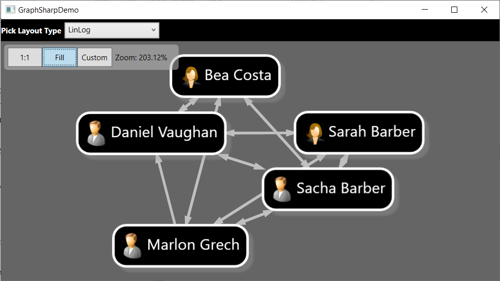

# GraphSharpDemo

## Introduction

Attempt to recreate Sacha Barbers [GraphSharp](https://github.com/NinetailLabs/GraphSharp) demo from the blog post [Pretty Cool Graphs In WPF](https://sachabarbs.wordpress.com/2010/08/31/pretty-cool-graphs-in-wpf/), using material from the post and the Code Project article [Experimenting with enterprise level bus messaging](https://www.codeproject.com/Articles/105380/Experimenting-with-enterprise-level-bus-messaging) by Sacha.

## Build and Test

- Open src\GraphSharpDemo\GraphSharpDemo.sln
- Restore nuget packages
- Build and run
